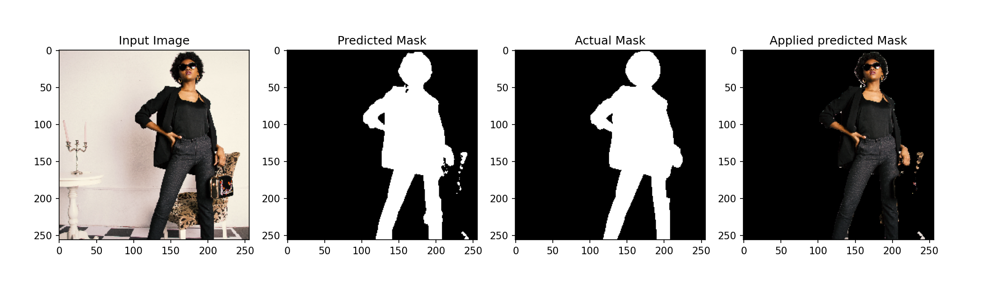

# Using Deep Learning for Image Matting

## Description
This project iteration is my first attempt at developing a DL model for image matting to isolate the actor(s) from the background scene. The final objective of this project is too reach similar or greater performance compared to [remove.bg](https://www.remove.bg/). In this version, I integrated a UNet model in PyTorch for image to image translation based on a modified model proposed in Ronneberger, O. et al. In addition to performing data augmentation, the following datasets where used: [Supervise.ly Filtered Segmentation Person Dataset](https://www.kaggle.com/datasets/tapakah68/supervisely-filtered-segmentation-person-dataset) and [Segmentation Full Body TikTok Dancing Dataset](https://www.kaggle.com/datasets/tapakah68/segmentation-full-body-tiktok-dancing-dataset).

## Hyperparameters
* **Learning rate**: 0.0001
* **Num. of Epochs**: 20
* **Image size**: 256 x 256
* **Batch size**: 10

## Model architecture
* **Optimizer**: Adam
* **Loss function**: BCEWithLogitsLoss (cross entropy loss that comes  inside a sigmoid function)

*Image by Ronneberger, O. et al.*

## Issues to solve
* Background artifacts still remain when close to the actor
* Matte voids in the actor
* Rough edges are common

## Acknowledgement
*Ronneberger, O., Fischer, P., Brox, T. (2015). U-Net: Convolutional Networks for Biomedical Image Segmentation. In: Navab, N., Hornegger, J., Wells, W., Frangi, A. (eds) Medical Image Computing and Computer-Assisted Intervention – MICCAI 2015. MICCAI 2015. Lecture Notes in Computer Science(), vol 9351. Springer, Cham. https://doi.org/10.1007/978-3-319-24574-4_28*